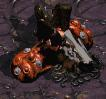

# EvolutionChamber

    
    

        <blockquote style="display: inline-block;">Genetic Algorithms applied to Snake.</blockquote>
    

## Experiments
Experiments are indexed a-z, in order of date of creation. Files are contained in `experiments/[a-z]_[description]`.

## Sanity Checks
### Sequence Repeater
`sequence repeater` is a simple game where repeating the observation back as an action yields reward. This can be used as a sanity check as it should be easily solvable within a few generations.

### Human-play Snake
`snake/play_human` allows a user to check functionality of the snake game. It includes a human-friendly observation format and takes input in the form of WASD or arrow keys.

### Simplified experiments
`experiments/e_survival_experiment` or `experiments/g_smaller_room` cut down on some complicated aspects of the game so individual components can be verified.

## Analysis
`analysis/show_video` loads and displays agents running in a human-friendly manner.
